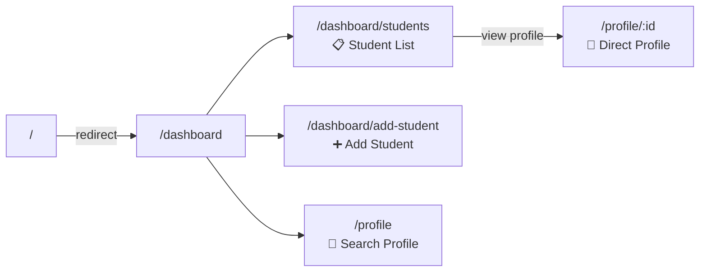
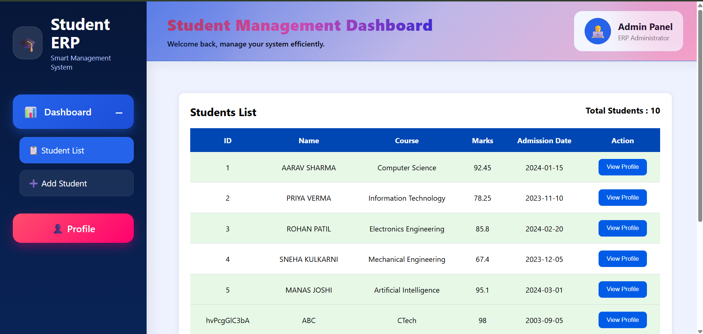
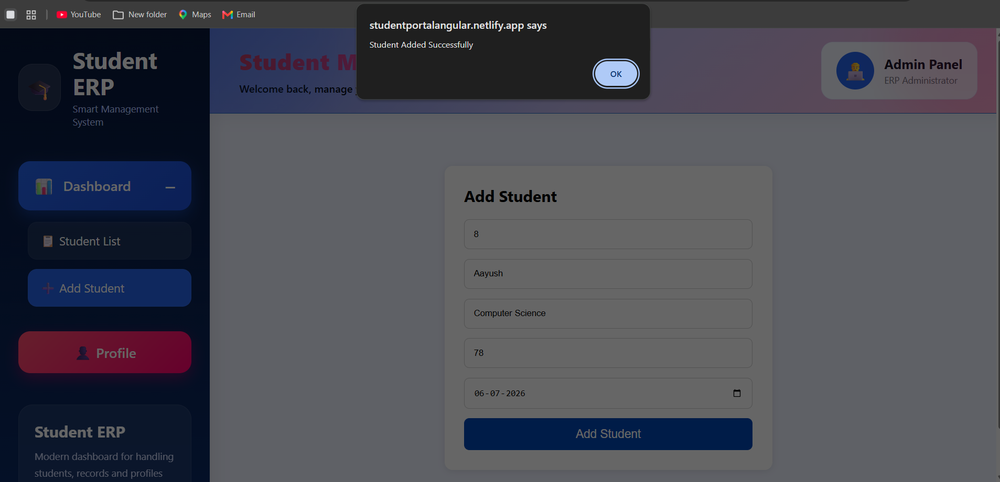
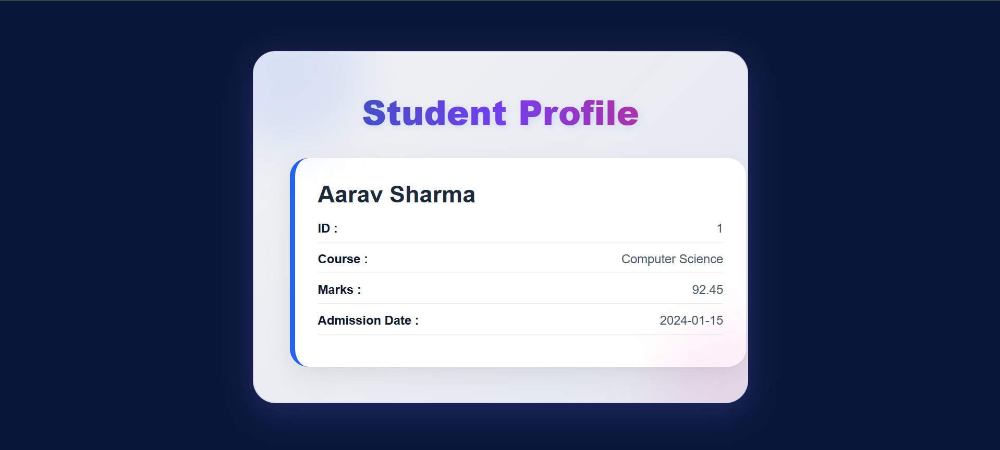
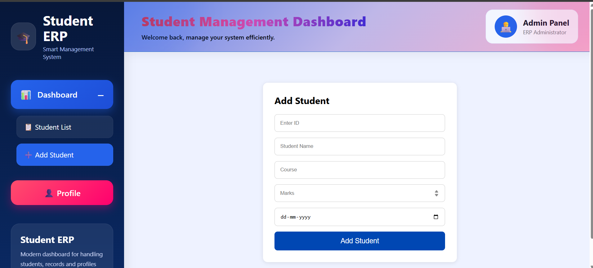
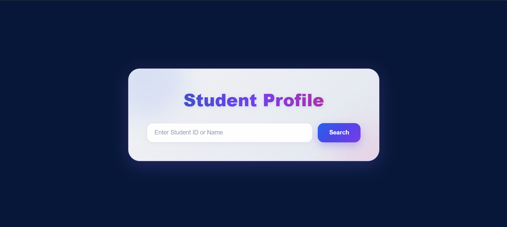

<div align="center">

# 🎓 Student ERP — Smart Management System

A clean, modern **Angular 21** web app for managing student records — add students, browse the full list, and look up a profile by ID or name, all backed by a lightweight JSON REST API.

[](https://angular.dev)
[](https://www.typescriptlang.org/)
[](https://github.com/typicode/json-server)
[](#-license)

[Features](#-features) • [Tech Stack](#-tech-stack) • [Getting Started](#-getting-started) • [Project Structure](#-project-structure) • [Routes](#-routes) • [API](#-api-reference) • [Roadmap](#-roadmap)

</div>

---

## 📖 About

**Student ERP** is a single-page application built with Angular's standalone component architecture. It gives an admin a simple dashboard to manage student records — no page reloads, no clutter, just a sidebar, a few forms, and instant search.

It's built as a learning/portfolio project to demonstrate real-world Angular concepts: routing with nested/child routes, reactive forms with validation, services + `HttpClient`, and a mock REST backend powered by `json-server`.

## ✨ Features

| | |
|---|---|
| 📊 **Dashboard Layout** | Sidebar navigation with a collapsible dropdown menu and an admin header panel |
| 📋 **Student List** | Fetches and displays all students from the API in a live table |
| ➕ **Add Student** | Reactive form (with validation) to add new students — ID, name, course, marks, admission date |
| 👤 **Profile Lookup** | Search a student by **ID or name**, or open a profile directly via `/profile/:id` |
| 🔗 **Nested Routing** | `dashboard/students` and `dashboard/add-student` as child routes inside the dashboard shell |
| 🎨 **Font Awesome Icons** | Integrated icon set for a polished UI |
| ⚡ **Standalone Components** | No `NgModules` — built entirely with Angular's modern standalone API |

## 🛠️ Tech Stack

| Layer | Technology |
|---|---|
| Framework | [Angular 21](https://angular.dev) (standalone components) |
| Language | TypeScript 5.9 |
| Forms | Angular Reactive Forms |
| HTTP | Angular `HttpClient` |
| Styling | CSS3 + Font Awesome |
| Mock Backend | [json-server](https://github.com/typicode/json-server) |
| Testing | Vitest |

## 🖥️ App Walkthrough



## 🚀 Getting Started

### Prerequisites

- [Node.js](https://nodejs.org/) (v18+ recommended)
- npm (comes with Node.js)
- Angular CLI — `npm install -g @angular/cli` (optional, `npx ng` also works)

### 1. Clone the repository

```bash
git clone https://github.com/Manaswi-Nimje/Employee-Management-System.git
cd Employee-Management-System
```

### 2. Install dependencies

```bash
npm install
```

### 3. Start the mock API server

The app talks to a REST API at `http://localhost:4500/students`, served from `students.json` via `json-server`:

```bash
npx json-server --watch students.json --port 4500
```

> Keep this terminal running — it's your "backend" for the whole app.

### 4. Start the Angular dev server

In a **second terminal**:

```bash
npm start
```

Then open your browser at **[http://localhost:4200](http://localhost:4200)** 🎉

The app will auto-reload whenever you edit a source file.

## 📁 Project Structure

```
StudentProject/
├── public/                     # Static assets (favicon, etc.)
├── src/
│   ├── app/
│   │   ├── dashboard/          # Sidebar layout + router-outlet shell
│   │   ├── studentlist/        # Fetches & renders all students
│   │   ├── addstudent/         # Reactive form to add a student
│   │   ├── profile/            # Search / direct profile view
│   │   ├── studentservice.ts   # HttpClient service (GET/POST students)
│   │   ├── app.routes.ts       # Route definitions (incl. nested routes)
│   │   └── app.ts              # Root standalone component
│   ├── assets/                 # Images
│   ├── index.html
│   └── main.ts                 # App bootstrap
├── students.json               # Mock database for json-server
├── angular.json
├── package.json
└── README.md
```

## Homepage


## Add Student


## View Profile


## Add Student Page


## View Studemt


## View By Id


## 🧭 Routes

| Path | Component | Description |
|---|---|---|
| `/` | — | Redirects to `/dashboard` |
| `/dashboard` | `DashboardComponent` | Sidebar shell with nested router-outlet |
| `/dashboard/students` | `StudentlistComponent` | Table of all students |
| `/dashboard/add-student` | `AddstudentComponent` | Form to add a new student |
| `/profile` | `ProfileComponent` | Search a student by ID or name |
| `/profile/:id` | `ProfileComponent` | View a specific student's profile directly |

## 🔌 API Reference

The service layer (`studentservice.ts`) talks to `json-server` on port `4500`:

| Method | Endpoint | Description |
|---|---|---|
| `GET` | `/students` | Returns the full list of students |
| `POST` | `/students` | Adds a new student record |

**Student object shape:**

```json
{
  "id": "1",
  "studname": "Aarav Sharma",
  "course": "Computer Science",
  "marks": 92.45,
  "admissionDate": "2024-01-15"
}
```

## 🧪 Running Tests

```bash
npm test
```

Runs unit tests via **Vitest**.

## 🗺️ Roadmap

- [ ] Edit / delete student records
- [ ] Replace `json-server` with a real backend (Node/Express or Spring Boot)
- [ ] Add authentication for the admin panel
- [ ] Client-side sorting & filtering on the student list
- [ ] Charts on the dashboard (attendance, marks distribution, etc.)

## 🤝 Contributing

Contributions, issues, and feature requests are welcome!

1. Fork the project
2. Create your feature branch (`git checkout -b feature/amazing-feature`)
3. Commit your changes (`git commit -m 'Add some amazing feature'`)
4. Push to the branch (`git push origin feature/amazing-feature`)
5. Open a Pull Request

## 📄 License

This project is licensed under the **MIT License**.

## 👩‍💻 Author

**Manaswi Nimje**
[GitHub](https://github.com/Manaswi-Nimje) · [Repository](https://github.com/Manaswi-Nimje/Employee-Management-System)

<div align="center">

⭐ If you found this project useful, consider giving it a star!

</div>
